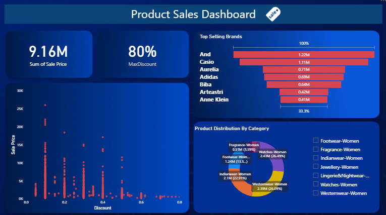

# Sales Analysis Project

## Table of Contents
- [Project Background](#project-background)
- [Data Source](#data-source)
- [Tools Used](#tools-used)
- [Executive Summary](#executive-summary)
- [Dashboard Preview](#dashboard-preview)
- [Recommendations](#recommendations)
- [Assumptions and Caveats](#assumptions-and-caveats)

## Project Background
This project presents an end-to-end analysis of product sales for a retail store. The primary goal is to uncover sales trends, identify top-performing products and categories, and provide actionable insights to enhance sales performance and optimize operational strategies.

## Data Source
The dataset used for this analysis is a CSV file named `Product.csv`. It contains transactional data and product details. Each row in the dataset represents a unique product with the following attributes:

- **S.No**: Serial Number
- **BrandName**: Name of the brand
- **Product ID**: Unique identifier for each product
- **Product Name**: Name of the product
- **Brand Desc**: Description of the brand
- **Product Size**: Available sizes for the product
- **Currency**: Currency of the price (Rands)
- **MRP**: Maximum Retail Price
- **SellPrice**: The price at which the product is sold
- **Discount**: Discount offered on the product
- **Category**: Product category (e.g., Fragrance-Women, Westernwear-Women)

## Tools Used
- **Microsoft Excel**: For initial data cleaning, transformation, and preliminary analysis.
- **Microsoft Power BI**: For creating an interactive dashboard, performing in-depth analysis, and visualizing the findings.

## Executive Summary
This comprehensive sales analysis of product performance for a retail store reveals critical insights into revenue generation, product dynamics, and brand contributions. With a total revenue of $9.16 million, the study highlights a strategic pricing model evident in the strong positive correlation between product price points and applied discount percentages.

## Dashboard Preview
Below is a preview of the Power BI dashboard created for this analysis.

**Key Findings:**
*   **Total Revenue:** $9.16 million.
*   **Pricing Strategy:** A robust positive correlation exists between product price points and applied discount percentages, indicating a well-defined pricing model.
*   **Top-Performing Brands:** "And India," "Casio," "Aurelia," and "Adidas" are identified as the leading revenue generators, contributing $1.22M, $1.11M, $0.71M, and $0.69M respectively.

These findings provide actionable intelligence to optimize inventory management, refine marketing strategies, and enhance overall pricing models, ultimately driving improved sales performance.

## Recommendations
Based on the analysis:
- Top-performing products should be kept in stock .
- Marketing should be directed towards products from "And India," "Casio," "Aurelia," and "Adidas" as they tend to generate higher sales.
- Pricing and discount adjuststments; higher discount items recieved higher sales regardless of discount so discount percentage should be reduced in order to maximize profit.

## Assumptions and Caveats
- The dataset is a complete and accurate representation of all sales.
- The analysis covers a specific time period.

